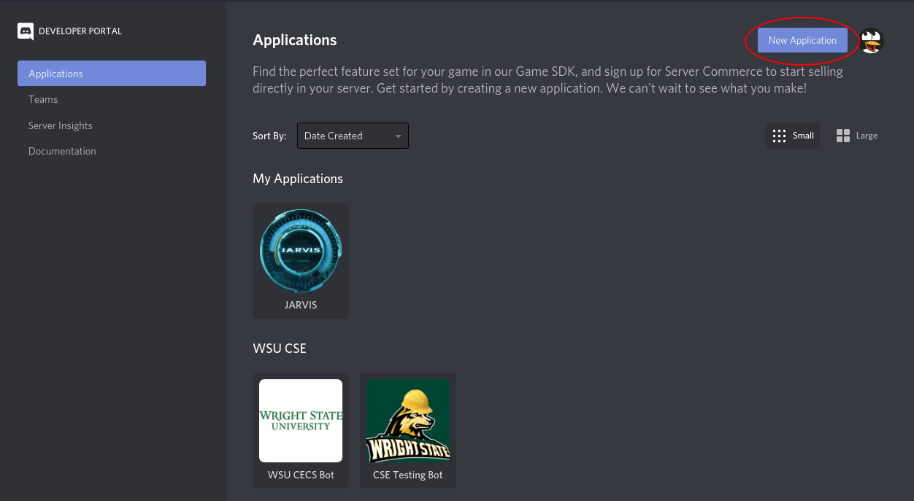
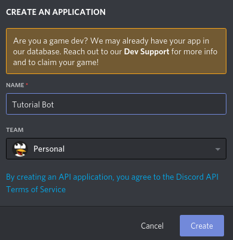
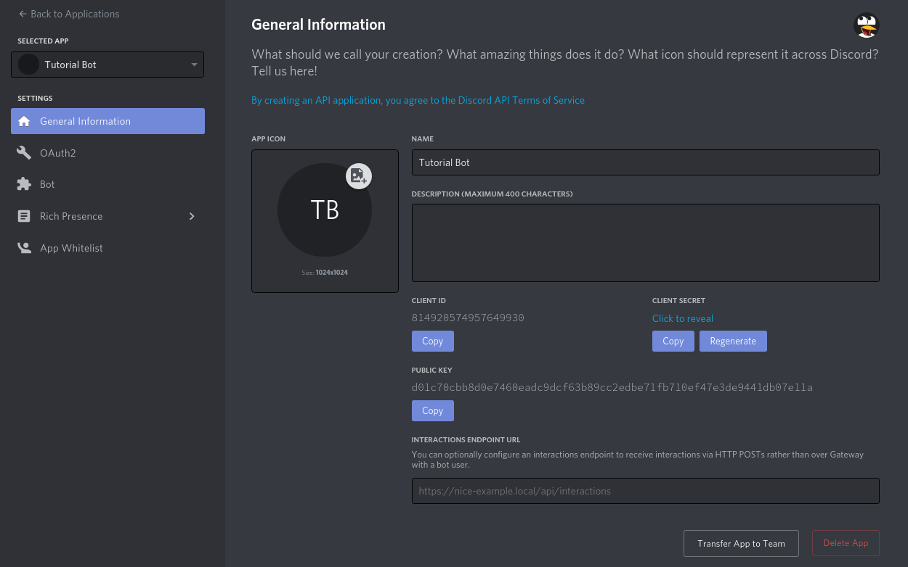
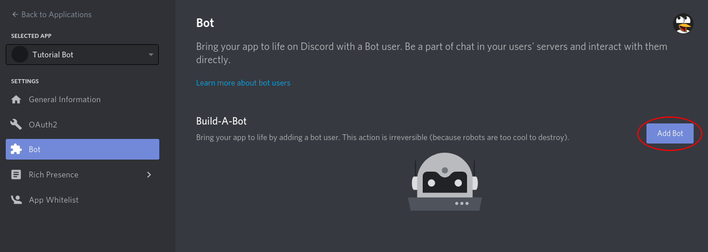
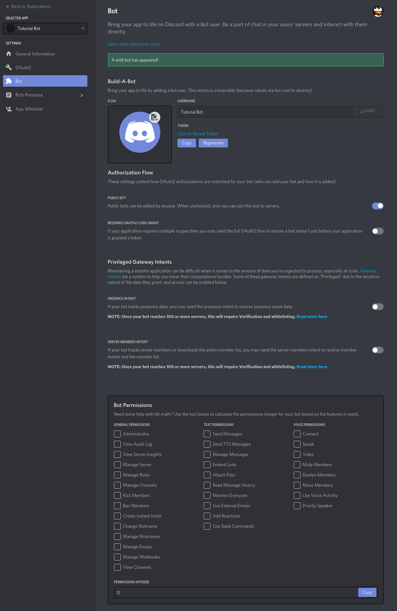
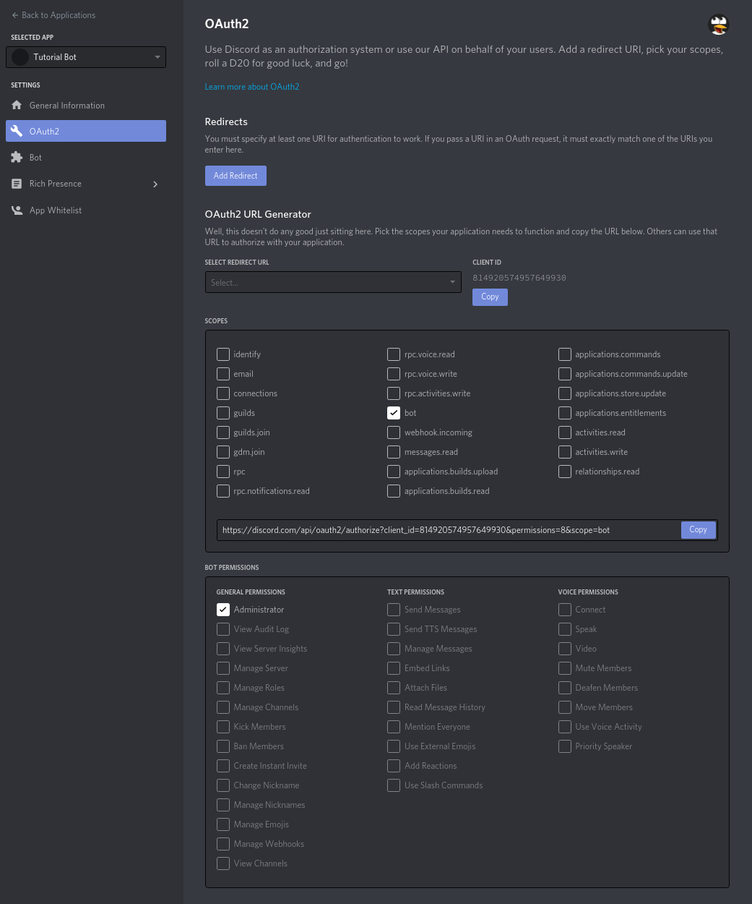
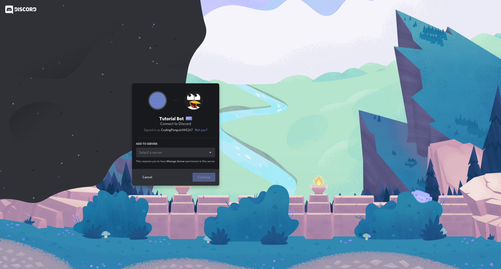
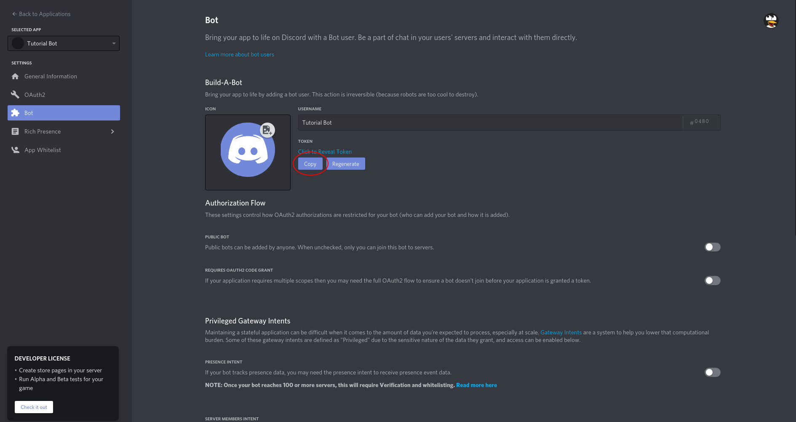

# Discord Bot Introduction

## What is a Discord bot?

Discord bots are fundamentally the same as a normal user, just controlled by a program instead of a person. Bots can be used to play music, answer questions, automate server management, distribute roles, and much more! Check out [top.gg](https://top.gg/) to see some of the most popular Discord bots.

## What does CSE use Discord bots for?

We use Discord bots for a lot of things. Here are some of the big ones:

- Role management: Generate the role menus in the class-selection channels, and assign/remove roles based on how people react
- Channel creation: automate the creation of each class category
- Corgis: we like sending pictures of cute corgis

## Why does CSE have its own Discord bot, as opposed to using other bots?

I'm sure you've noticed that we have two other bots besides the [WSU CSE Bot](https://github.com/cse-devteam/CSE-Discord-Bot). [YAGPDB.xyz](YAGPDB.xyz) (known as Friendly Helper Bot) is a general-purpose server management and moderation bot. It provides role menu functionality, custom commands, welcome messages, logging, etc. [MathBot](https://top.gg/bot/mathbot) (known as Artistic Helper Bot) can query WolframAlpha and render LaTeX. We used to have a few more bots, but we started running into issues with some of them randomly going offline for an uncertain amount of time. We determined that developing an in-house solution would allow us to have more control over the bots essential to keeping the server running. It also allowed us to create custom solutions, such as the channel creation system. YAGPDB.xyz and MathBot provide functionality that we have not yet duplicated, which is why they have not been removed from the server yet.

## How to make your own Discord bot

### Create the application

Discord provides an API for interfacing with Discord servers. This is usually done through a bot, but you can access the API from more than just bots. Livestream integrations and statistic-tracking programs are just two examples of things you can do with the Discord API besides making bots. Because Discord provides such extensive functionality with their API, you need to make an application before you can make a bot. An application provides the authentication information required to access the API. You can then create a bot, integration, or other program under the application.

Go to the [Discord Developer Portal](https://discord.com/developers/applications/)

Click `New Application`



Fill out a name, and optionally, assign the bot to a team. Teams are groups of people who can manage the bot settings (similar to a GitHub organization)



You will be taken to the General Information page of your application. Here you can change the name and icon of your application. These will be used as the default username and profile picture of your bot. Make them unique!



### Create the bot

Now, we get to make the bot! On the left sidebar, go to `Bot` and click `Add Bot`



After confirming that you actually want to make a bot, the page will be updated with a ton of buttons and levers to hit:



You'll want to turn off `PUBLIC BOT` (unless you want your bot to be public). I recommend leaving the bot private while you develop it. There's no need to make it public unless you intend for it to be distributed to other servers, especially those that you may not be a member of.

### Invite the bot

Finally, it's time to invite the bot to your server! On the left sidebar, go to `OAuth2`. We'll use the OAuth2 URL Generator to generate an invite link. Since we're making a bot, tick `bot` under `SCOPES`. A section called `BOT PERMISSIONS` should appear. When a bot is invited to a server, a role is created with the permissions specified in this section. The bot is automatically assigned this role when it joins the server. For testing purposes, give the bot the `Administrator` permission. This permission encapsulates all other permissions, which means the bot will be able to do \*nearly everything.



Open the link generated at the bottom of the `SCOPES` section in a new tab. Click the drop-down menu, and select the server you would like to invite the bot to. For this tutorial, invite the bot to the `CSE Testing Server`. You should be an admin.



\*The bot will have full permission to do anything EXCEPT for modifying its own role or roles above it in the server's settings, as well as read/modify any channels the bot role cannot access.

## Running the bot

Firstly, clone this repository (if you haven't already).

You'll need to install the [discord.py Python module](https://pypi.org/project/discord.py/). Run `pip install discord.py`.

Next, you'll need to get the bot's token. This is used to tell Discord which bot should be run off the code. Go back to the `Bot` page, and copy your token.



There are many ways you can store this token. Our preferred method is .env. Create a file called `.env` in the same directory as `bot.py`. Fill it with this:

```env
# .env
DISCORD_TOKEN=YOUR.TOKEN.HERE
```

Where, obviously, `YOUR.TOKEN.HERE` is the token you just copied. Then, all you need to do is run `./bot.py`, and you should see your bot come online!

## Code description

### bot.py

#### Imports

Most of the imports are pretty standard. The only notworthy one is `from Cogs import *`. One of the primary functions of Discord bots is the ability to execute commands called by users. Cogs are simply groups of commands, which helps to separate the code into managable sections, as well as makes the output of the help command more organized. We will revisit Cogs shortly.

#### Global variables

`TOKEN` - the bot's token. This is read from the .env file (preloaded by `load_dotenv()`)
`bot` - a bot object. Useful for doing things with bots. Pretty self-explanatory

#### Main function

There's some cool Python trickery here. Basically, it loops through all the files in the `Cogs/` directory and (paired with `from Cogs import *`) loads the cogs into the bot. The syntax is pretty advanced Python, so don't worry if you don't understand it. Just accept that it works, and move on. The bot is then started with the collected token with `bot.run(TOKEN)`

#### on_ready()

Everything in Discord bot programming is asynchronous. I recommend reading up on it [here](https://medium.com/velotio-perspectives/an-introduction-to-asynchronous-programming-in-python-af0189a88bbb). Basically, it allows us to continue to receive events and commands while processing one. The `@bot.event` tag above the function declaration tells the bot that this function is an event, and therefore should be executed when some event is detected. Because the function name is `on_ready`, the bot will run this function once it is "ready" to start processing commands. It's a good idea to have an `on_ready()` function, so you can load things on startup, as well as know if the bot has _actually_ started.

### Cogs/Default.py

This is a cog. Rather, the `Default` class in this file is a subclass of the abstract Cog superclass. `__init__()` is the constructor, which saves a pointer to the bot object as a property of the `Default` class. This class has two methods:

`hello()` - Note the `@commands.command()`. This tells the bot that this method is a command, as opposed to an event or normal function. It should seem similar to the `@bot.event` we saw earlier. The parameter `ctx` is the "context" in which this command was run. It contains a lot of information about the message that called this command, such as the contents, author, server and channel it was sent in, and much more. It also provides an asynchronous function `send()`, which allows the bot to send a parameter string in the same channel as the message that called this command was sent in.

`ping()` - You should be able to figure this one out. It's basically the same as `hello()`, but it sends the network latency the bot is experiencing with Discord's servers.

### Cogs/**init**.py

This is another instance of Python magic, so don't worry if you don't understand it. Basically, it makes the `Cogs/` directory into a Python module, which allows us to import all the files contained in one line. If you want to add a new cog in the future, put it in `Cogs/` and add `from Cogs.FILENAME import CLASSNAME` to this file.

## Conclusion/notes

That's it! That's all there is to making a simple Discord bot. Now it's on you to add more commands and events and make it do all sorts of fun things.

If you want to read more about [discord.py](https://discordpy.readthedocs.io/en/latest/), I recommend checking out [the discord.py documentation](https://discordpy.readthedocs.io/en/latest/)
